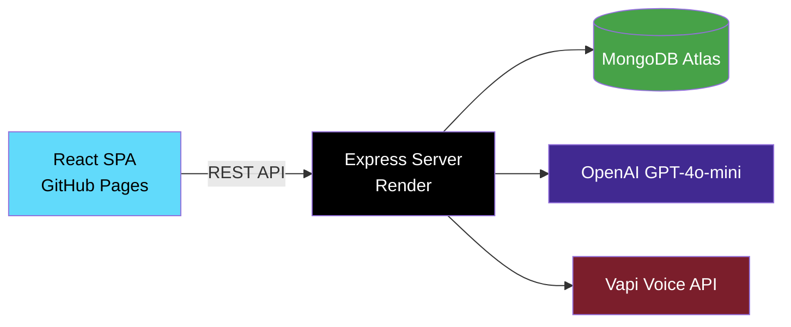

# EduReach — College Intelligence Platform

AI-powered college counseling platform with RAG-based chatbot, voice calls, conversation persistence, and a personalized dashboard.

[](https://www.typescriptlang.org/)
[](https://react.dev/)
[](https://expressjs.com/)
[](https://www.mongodb.com/)
[](https://openai.com/)
[](https://tailwindcss.com/)

---

## Architecture



## Features

| Feature | Description |
|---------|-------------|
| **AI Chatbot (RAG)** | Knowledge base-powered chatbot using GPT-4o-mini with conversation history |
| **Chat Persistence** | Conversations stored in MongoDB, accessible via history panel |
| **Voice Counselor** | AI-powered outbound calls via Vapi integration |
| **Dashboard** | Personalized stats, recent conversations, quick actions |
| **Dark Mode** | System-aware theme with light/dark/system toggle |
| **JWT Auth** | Secure registration/login with bcrypt + rate limiting |
| **Responsive UI** | Mobile-first design with Framer Motion animations |
| **Accessibility** | ARIA labels, skip navigation, focus trapping, reduced motion support |

## Tech Stack

### Frontend
- **React 19** with TypeScript (strict mode)
- **Vite 6** — build & dev server
- **Tailwind CSS 4** — utility-first styling with custom theme
- **Framer Motion** — smooth animations
- **React Router 7** — SPA routing with lazy loading
- **Axios** — HTTP client with interceptors
- **react-markdown** — rich text rendering in chat

### Backend
- **Express 5** with TypeScript (ESM)
- **MongoDB** via Mongoose 9 — users, conversations
- **LangChain + OpenAI** — RAG chatbot with conversation memory
- **JWT** — stateless authentication with bcrypt
- **Helmet** — security headers
- **Rate Limiting** — per-endpoint (auth: 15/15min, chat: 20/min)
- **Morgan** — request logging
- **Compression** — gzip responses

### Infrastructure
- **GitHub Pages** — frontend hosting
- **Render** — backend hosting (free tier)
- **GitHub Actions** — CI/CD pipeline
- **MongoDB Atlas** — managed database

## Getting Started

### Prerequisites
- Node.js 22+
- MongoDB Atlas account
- OpenAI API key

### Installation

```bash
# Clone the repository
git clone https://github.com/your-username/edu-reach.git
cd edu-reach

# Install dependencies
cd client && npm install
cd ../server && npm install
```

### Environment Setup

**Server** — copy `server/.env.example` to `server/.env` and fill in:
```env
PORT=5000
MONGODB_URI=your_mongodb_uri
JWT_SECRET=your_jwt_secret
OPENAI_API_KEY=your_openai_key
CLIENT_URL=http://localhost:5173
```

**Client** — copy `client/.env.example` to `client/.env.local`:
```env
VITE_API_URL=http://localhost:5000/api
```

### Run Development

```bash
# Terminal 1 — Backend
cd server && npm run dev

# Terminal 2 — Frontend
cd client && npm run dev
```

## Project Structure

```
edu-reach/
├── client/                          # React frontend
│   ├── src/
│   │   ├── components/
│   │   │   ├── sections/            # Landing page sections (10)
│   │   │   ├── ui/                  # Reusable UI components
│   │   │   ├── ChatDrawer.tsx       # AI chat with history
│   │   │   ├── ThemeToggle.tsx      # Dark mode toggle
│   │   │   ├── ProtectedRoute.tsx   # Auth route guard
│   │   │   └── ...
│   │   ├── pages/
│   │   │   ├── DashboardPage.tsx    # User dashboard
│   │   │   ├── HomePage.tsx         # Landing page
│   │   │   └── ...
│   │   ├── context/
│   │   │   ├── AuthContext.tsx      # JWT auth state
│   │   │   └── ThemeContext.tsx     # Dark mode state
│   │   └── services/               # API service layer
│   └── public/
├── server/                          # Express backend
│   ├── src/
│   │   ├── controllers/            # Route handlers
│   │   ├── models/                 # Mongoose schemas
│   │   ├── middleware/             # Auth, rate limit, errors
│   │   ├── routes/                 # API routes
│   │   ├── services/              # RAG, Vapi
│   │   └── config/                # DB, env config
│   └── knowledge-base/            # College information (RAG source)
├── .github/workflows/              # CI/CD
└── README.md
```

## API Endpoints

| Method | Path | Auth | Description |
|--------|------|------|-------------|
| POST | `/api/auth/register` | No | Create account |
| POST | `/api/auth/login` | No | Login, get JWT |
| GET | `/api/auth/me` | Yes | Current user profile |
| POST | `/api/chat/message` | Optional | Send message to AI chatbot |
| GET | `/api/conversations` | Yes | List user's conversations |
| GET | `/api/conversations/stats` | Yes | Dashboard stats |
| GET | `/api/conversations/:id` | Yes | Get conversation with messages |
| DELETE | `/api/conversations/:id` | Yes | Delete conversation |
| POST | `/api/vapi/call` | Yes | Initiate AI voice call |
| GET | `/api/health` | No | Server health check |

## Deployment

### Frontend (GitHub Pages)
Push to `main` triggers automatic deployment via GitHub Actions.

### Backend (Render)
1. Create a new Web Service on [Render](https://render.com)
2. Connect your GitHub repo
3. Set root directory to `server`
4. Add environment variables from `.env.example`
5. Deploy

## License

MIT
